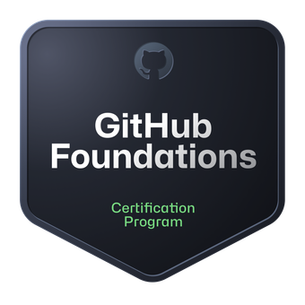
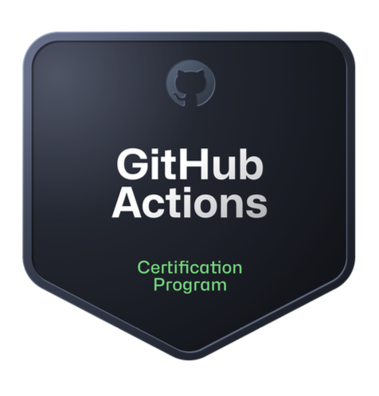
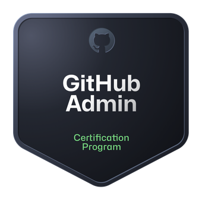
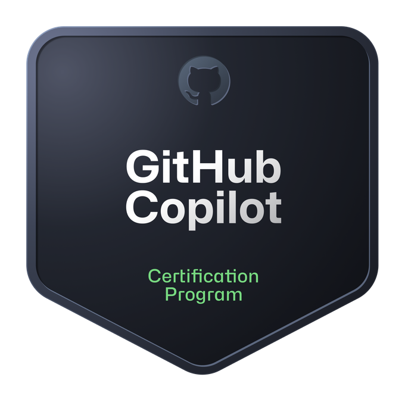
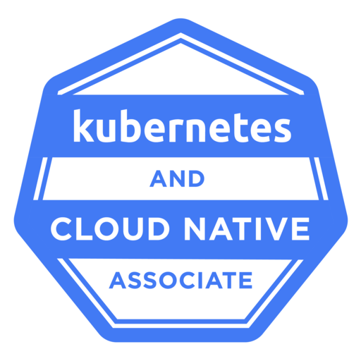
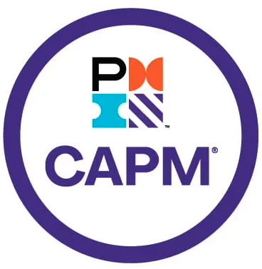
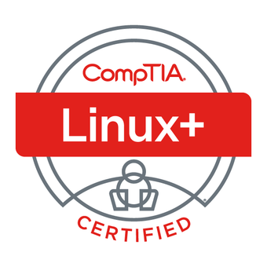
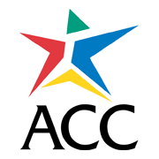

## 👤 About Me 
Hi there 👋
My name is Kendall. I recently (10DEC24) joined the GitHub team as a Customer Reliability Engineer III. This space showcases a little bit about me. 

### 💼 Professional Background
Originally educated in the humanities, I taught EFL abroad for many years 🌏. I became interested in tech around 2007 when I grew bored of grading papers and was searching for a way to automate the process with a learning management system. My fascination with LMS, CMS, and modular programming continues to this day! After a few years dabbling with code as a hobbyist, I eventually committed to computer science in 2018 when I returned to school to study the field formally 🎓. Since then, I've had the good fortune to work in both the FAANG and startup worlds in a variety of roles 🧑‍💻. 

### 🗂️ Current Projects
<!-- While onboarding, I made this amazing Octocat:

 -->
Seeking the following certifications currently:
- 📌 GitHub Administration
- 🛡️ GitHub Advanced Security

### 🛠️ Skills
- **Languages & Frameworks:** Python, JavaScript, Java, Kotlin, PHP, HTML, CSS, Node.js
- **Tools & Technologies:** Git, Docker, Kubernetes, AWS

### 🎓 Certifications Awarded

| Certification       | Badge                                                                 | Certification       | Badge                                                                 |
|---------------------|----------------------------------------------------------------------|---------------------|----------------------------------------------------------------------|
| GitHub Foundations  |  | GitHub Actions      |        |
| GitHub Administration |    | GitHub Copilot      |        |
| KCNA                |              | CCP                 |                |
| CAPM                |              | Linux               |            |
| Software Testing    |                | Web Development     |                |

### 🌱 Interests
**Family:** Married, 14 y.o. daughter 👧, 11 y.o. son 👦
**Hobbies:**
- **Skiing:** 🎿
- **Crocheting:** 🧶
- **Movies:** 🎬
- **Family Time:** 👨‍👩‍👧‍👦

### 📫 Contact Me
Feel free to reach out to me on [LinkedIn](https://linkedin.com/in/krshearman).

